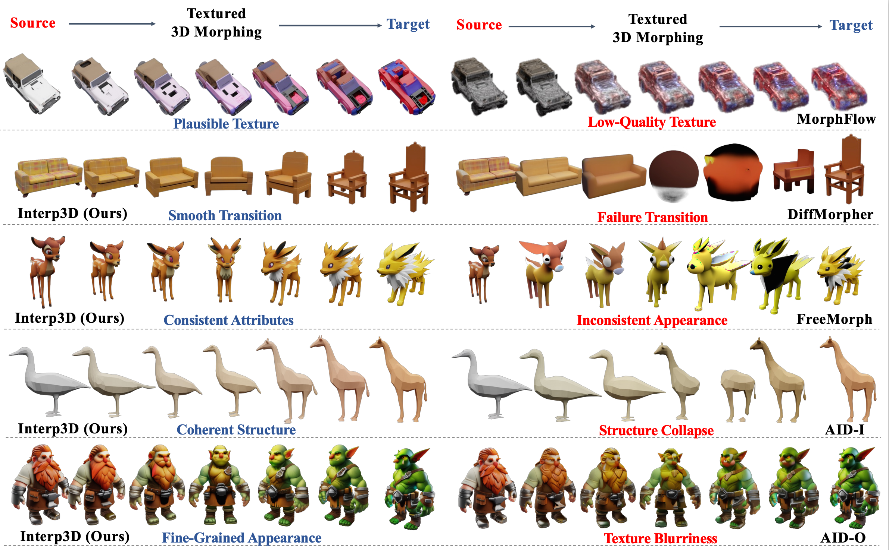

<div align="center">

# Interp3D: Correspondence-Aware Interpolation for Generative Textured 3D Morphing


<div>
    <strong>Xiaolu Liu</strong><sup>1,2</sup>,
    <strong>Yicong Li</strong><sup>2*</sup>,
    <strong>Qiyuan He</strong><sup>2</sup>,
    <strong>Jiayin Zhu</strong><sup>2</sup>,
    <strong>Wei Ji</strong><sup>3</sup>,
    <strong>Angela Yao</strong><sup>2</sup>,
    <strong>Jianke Zhu</strong><sup>1*</sup>
</div>


<div>
    <sup>1</sup>Zhejiang University &nbsp;&nbsp;
    <sup>2</sup>National University of Singapore &nbsp;&nbsp;
    <sup>3</sup>Nanjing University
</div>

<div>
    <sup>*</sup>Corresponding Authors
</div>

<br>
<p align="center">
<a href="https://arxiv.org/pdf/2601.14103"></a>
<a href='https://interp3d.github.io'></a>
</p>

<br>

</div>


In this work, we propose Interp3D, a training-free approach that instantiates the progressive alignment principle based on generative priors for textured 3D morphing. 


<!-- Installation -->
## Installation

Clone the repo:

```sh
git clone --recurse-submodules https://github.com/xialul2/Interp3D.git
cd Interp3D
```

Following the command in [TRELLIS](https://github.com/microsoft/TRELLIS) for the environment installation.

<!-- Run the Coder -->
## Run the Code

You can run the morphing process with the following command:

```sh
python example_interp.py --exp_id ./example_cases
```

<!-- Run the Coder -->
## Interp3DData

To evaluate the effectiveness of our methods, we present Inter3DData, the benchmark dataset for assessing the generative texture 3D Morphing . You can download the dataset from [Google Drive](https://drive.google.com/file/d/1Y-J_7KwEk8VFy_v19cF3wCgbTW8Pqff0/view?usp=sharing).


<!-- Citation -->
##  Citation

If you find this work helpful, please consider citing our paper:

```bibtex
@article{liu2026interp3d,
  title={Interp3D: Correspondence-Aware Interpolation for Generative Textured 3D Morphing},
  author={Liu, Xiaolu and Li, Yicong and He, Qiyuan and Zhu, Jiayin and Ji, Wei and Yao, Angela and Zhu, Jianke},
  journal={arXiv preprint arXiv:2601.14103},
  year={2026}
}
```
